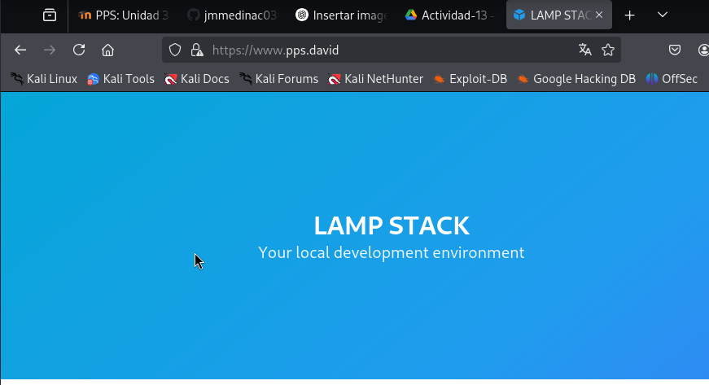

## PPS-Unidad3Actividad13-David
# Hardening de servidor web. Implementación de HTTPS, CPS, HSTS, mitigación de configuración insegura e instalar WAF de ModSecurity con Reglas CRS de OWASP

### Sitios Virtuales
Para crear un sitio virtual tendremos que hacerlo siguiente:

Modificar el archivo/etc/apache2/sites-available/000-default.conf

Una vez creado el archivo de configuración del sitio, lo habilitamos.

Si queremos acceder a este servidor virtual desde otros equipos de la red, o si estamos utilizando docker y queremos acceder a ellos desde nuestro navegador, tenemos que añadir en el /etc/hosts una linea que vincule la dirección ip con el nombre del servidor:

Ya podemos acceder a nuestro servidor desde:

### Cómo habilitar HTTPS con SSL/TLS en Servidor Apache

Creamos el certificado autofirmado:

Editar el archivo de configuración de Apache default-ssl.conf:

Activamos SSL mediante la habilitación de la configuración default-ssl.confque hemos creado:

Ahora el servidor soportaría HTTPS. Accedemos al servidor en la siguiente dirección

### Forzar HTTPS en Apache2 (default.conf y .htaccess)

Para forzar el https deberemos de hacer lo siguiente:

Editar tu archivo de configuración del sitio:

### Identificación y Corrección de Security Misconfiguration

Para comprobar si hay exposición de información sensible en nuestro servidor ejecutamos:

Si la respuesta contiene:Server: Apache/2.4.41 (Ubuntu) y/o X-Powered-By: PHP/7.4.3 el sistema nos está ofreciendo información sobre las versiones de Apache y PHP.

Editar la configuración del módulo de seguridad de apache para ocultar versión del servidor en Apache:

Comprobamos que no nos sale la version de nuestro Apache:

Para ocultar la visión de la versión de php debemos de entrar al fichero de /usr/local/etc/php/php.ini:

### Configuración de mod_security con reglas OWASP CRS en Apache

Tenemos un fichero vulnerable a estos ataques:

Verificamos que mod_security esté cargado:

Para comprobar si están añadidas las reglas de modsecurity-crs, puedes hacer:

Esto hará que el WAF bloquee solicitudes peligrosas automáticamente.

Probamos los ataques que hemos realizado al principio del punto.

